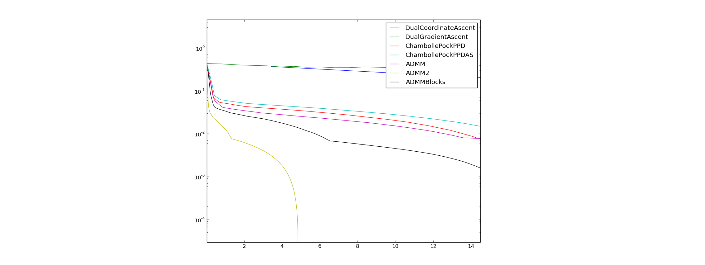
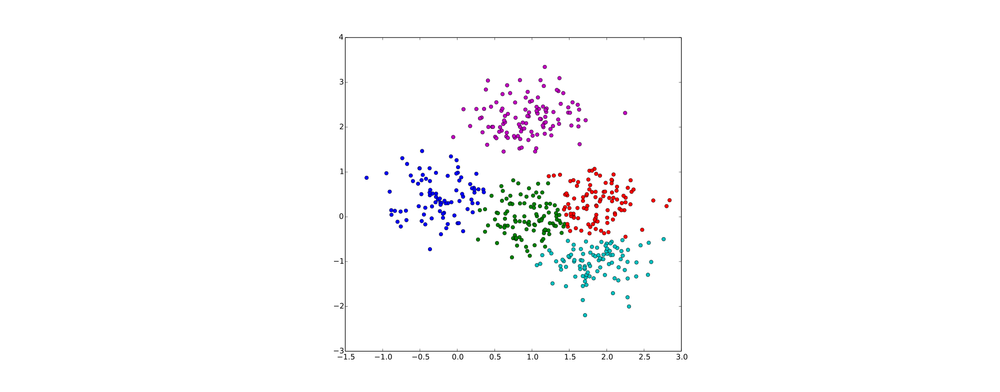
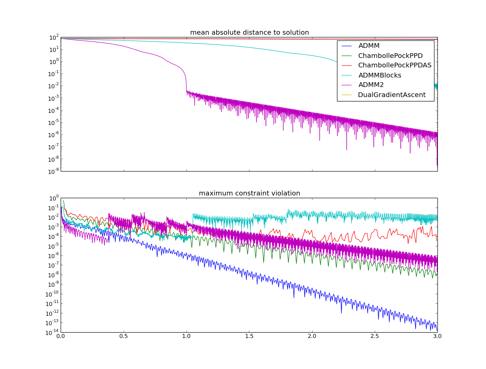

# Goal

This project provides several python codes to solve very sparse linear programs of the form

The different algorithms that are implemented are documented in the [pdf](./latex/SparseLinearProgramming.pdf): 

* a dual coordinate ascent method with exact line search 
* a dual gradient ascent with exact line search
* a first order primal-dual algorithm adapted from chambolle pock [2]
* three methods based on the Alternating Direction Method of Multipliers [3]

**Note** These methods are not meant to be efficient methods to solve generic linear programs. They are simple and quite naive methods i coded while exploring different possibilities to solve very large sparse linear programs that are too big to be solved using the standard simplex method or standard interior point methods.

This project also provides: 

* a python implementation of Mehrotra's Predictor-Corrector Pimal-Dual Interior Point method.
* a python class *SparseLP* (in SparseLP.py) that makes it easier to build linear programs from python 
* methods to convert between the different common forms of linear programs (slack form, standard form etc), 
* methods to import and export the linear program from and to standard file formats (MPS), It is used here to run [netlib](http://www.netlib.org/lp/data/) LP problems. Using mps file one can upload and solve LP on the [neos](https://neos-server.org/neos/) servers.
* a simple constraint propagation method with back-tracking to find feasible integer values solutions (for integer programs)
* interfaces to other solvers (SCS, ECOS, CVXOPT) through CVXPY
* interfaces to other LP and MILP solvers ([CLP](https://www.coin-or.org/download/binary/Clp/),[CBC](https://www.coin-or.org/download/binary/Cbc/),[MIPLC](http://mipcl-cpp.appspot.com/),[GLPSOL](https://sourceforge.net/projects/winglpk/),[QSOPT](http://www.math.uwaterloo.ca/~bico/qsopt/downloads/downloads.htm)) using mps text files
# Installation

using pip

	sudo pip install git+git://github.com/martinResearch/PySparseLP.git
	
otherwise you can dowload it, decompressit it and compile it locally using 

	python setup.py build_ext --inplace

If you want to be able to run exernal solvers using mps files in windows then download the following executables and copy them in the solvers\windows subfolder

* [clp.exe](https://www.coin-or.org/download/binary/Clp/) 
* [cbc.exe](https://www.coin-or.org/download/binary/Cbc/) 
* [mps_mipcl.exe](http://mipcl-cpp.appspot.com/)
* [glpsol.exe and glpk_4_63.dll](https://sourceforge.net/projects/winglpk/)
* [qssolver.exe](http://www.math.uwaterloo.ca/~bico/qsopt/downloads/downloads.htm)

# LP problem modeling

A python class *SparseLP* (in SparseLP.py) that makes it easier to build linear programs from python. Easy to derive a specialize class from it and add specialized constraints creations methods (see pott penalization in example 1). 
SparseLP is written in python and relies an scipy sparse matrices and numpy matrices to represent constraint internally and for its interface. There is no variables class binding to c++ objects. This makes it potentially easier to interface with the python scientific stack. 

Creating variables

 * *addVariablesArray(self,shape,lowerbounds,upperbounds,costs=0,name=None,isinteger=False)*

Various method to add constraints:

 * *addLinearConstraintRow*. Add a single row at the bottom of the constraints matrix. cols and vals should be vector of same size (flatten internaly if arrays)
 * *addLinearConstraintRows(self,cols,vals,lowerbounds=None,upperbounds=0)*. Add a set of rows that all have the same number of non zero values at the bottom of the constraints matrix. cols and vals should be 2D arrays of same size with each row cols[i,:] with vals[i,:] defines a different a sparse constraint to add.
penalization (this is done under the hood by creating planlized slack variables)
 * *addLinearConstraintsWithBroadcasting*
 * *addInequalities*. Take a list of tuples (indices,coefs) that are tiled if needed to get the right size. More flexible than addSoftLinearConstraintRows as coefs can heterogenous across tuples (scalar or vector)
 * *addConstraintsSparse*. Just append the sparse matrix under the existing constraints matrix and add bound and costs in 
  bound vectors.
 * *addSoftLinearConstraintRows*. same as addLinearConstraintRows but constraints are soft constraint with some  
 

other main methods 

 * *setCostsVariables*
 * *getVariablesIndices*
 * *solve(method,getTiming,nb\_iter,max\_time,groundTruth,groundTruthIndices,plotSolution)*
 * *saveMPS*

We can check the feasibility of a solution using

* maxConstraintViolation
* checkSolution

Often the sparse constraints matrix can naturally be decomposed vertically into blocks. The ADMM Block method aims to exploiting that decompistion. Blocks are defined using the method *startConstraintName* and *endConstraintName*. This allow to inform the ADMM block method where to split the constraints matrix.
 
## Debuging

Building a LP problem is often error prone. If we can generate  a valid solution before constructing the LP we can check constraints are not violated as we add them to the LP using checkSolution. This make it easier to pin down where constraint is causing problem. We could add a debug glag so that that check is automatic as we ad constraints.

## Other modeling tools
Other libraries provide modellign tools ([CyLP](http://mpy.github.io/CyLPdoc/index.html) , [GLOP](https://developers.google.com/optimization/lp/glop))
But they have some limitations:

* CyLP: use operator oveloading so that we can use notation that are close to mathetmatical notations. But variables are defined as 1D vectors
* GLOP:

the approach i have taken is a bit lower level than this tools  but provide more control and flexibility on how to define constraints and the objective function. It is made easy by using numpyarrays  to store variables indices.

# Examples

## Image segmentation
we can use it to solve a binary image segmentation problem with Potts regularisation.

with *E* the list of indices of pairs of neighbouring pixels and *c* a cost vector that is obtain from color distribution models of the two regions.
This problem can be rewritten as a linear progam by adding an auxiliary variable *d_ij* for each edge with the constraints

 
This problem can be more efficiently solved using graph-cuts but it is still interesting to compare the different generic LP solvers on this problem. 

	from pysparselp.example1 import run
	run()

segmentation with the same random data term with the optimisations limited to 15 seconds for each method

convergence curves

Instead of using a simple Potts model we could try to solve the LP from [5]

## Sparse inverse convariance matrix 
 
The Sparse Inverse Covariance Estimation aims to find
a sparse matrix B that approximate the inverse of Covariance matrix A.

let denote f the fonction that take a matrix as an input an yield the vector of coefficient of the matrix in row-major order.
let b=f(B) we have f(AB)=Mb with M=kron(A,I_d)
the problem rewrites

we take inspiration from this scikit-learn example [here](http://scikit-learn.org/stable/auto_examples/covariance/plot_sparse_cov.html) to generate 
samples of a gaussian with a sparse inverse covariance (precision) matrix. From the sample we compute the empirical covariance A and the we estimate a sparse inverse covariance (precision) matrix B from that empirical covariance using the LP formulation above.

	from pysparselp.example2 import run
	run()

## L1 regularised multi-class SVM

Given n examples of vector-class pairs *(x_i,y_i)*, with *x_i* a vector of size m and *y_i* an integer representing the class, we aim at estimating a matrix W of size k by m that allows to discriminate the right class, with k the number of classes. We assume that the last component of *x_i* is a one in order to represent the offset constants in W. we denote *W_k* the kth line of the matrix *W*

by adding auxiliary variables in a matrix S of the same size as the matrix W we can rewrite the absolute value as follow:

we obtain the LP formulation:

you can run the example using the following line in python

	from pysparselp.example3 import run
	run()

the support vectors are represented by black circles.

## Bipartite matching 

Bipartite matching can be reformulated as an integer program

we relax it into an LP.

	from pysparselp.example4 import run
	run()

## K-medians

Given n point we want to cluster them into k set by minimizing

with d_ij the distance between point i and point j
The can be reformulated as an integer program

 
we relax it into using 

![latex: $$ L_{ij}\in[0,1]$$](./images/kmedians2_relax.svg)
 
	from pysparselp.example5 import run
	run()

## Netlib LP problems 

We have an interface to easily test the solvers on netlib problems from [netlib](http://www.netlib.org/lp/data/). 
The uncompressed files are downloaded from [here](ftp://ftp.numerical.rl.ac.uk/pub/cuter/netlib/). 
In order to monitor convergence rates, the exact solutions of these problems are found [here](http://www.zib.de/koch/perplex/data/netlib/txt/)

	from pysparselp.test_netlib import test_netlib
	test_netlib('SC50A')

Note: since august 2017, numpy files containing the netlib examples are provided with scipy [here] (https://github.com/scipy/scipy/tree/master/benchmarks/benchmarks/linprog_benchmark_files)

## Random problems 

random sparse LP problem can be generate using code in *randomLP.py*. The approach used to generate random problem is very simple and could be improved
to generate harder sparse LPs. We could implement the approach used in section 6.2.1 in https://arxiv.org/pdf/1404.6770v3.pdf to 
generate random problems with the matlab code available [here](https://github.com/YimingYAN/pipm-lp/tree/master/Tests/Ultilities)

# TODO

* add automatic constraint checking if we provide a feasible solution from the begining. It will help debugging constraints.

* document the active-set *hack* for the chambole pock method (in ChambollePockPPDAS.py).

* finish coding the method by Conda (CondatPrimalDual.py)

* convert to python the matlab implementation of the LP solver based on improved version of champolle-pock called [Adaptive Primal-Dual Hybrid Gradient Methods](https://arxiv.org/abs/1305.0546) available [here](https://www.cs.umd.edu/~tomg/projects/pdhg/)

* create a cython binding for LPsparse [1] using scipy.sparse matrices for the interface and adding the possibility to compute the convergence curve by providing the problem known solution to the solver or by adding the possibility to define a callback to a python function.

* implement method [4]

* implement method in [5]

* add interface to [8] once the code is online.

* add simplex methods written in python, could get code from here https://bitbucket.org/jbolinge/lp or speedup scipy code 
 [here](https://github.com/scipy/scipy/blob/master/scipy/optimize/_linprog.py) by getting rid of slow loops and using cython.

* try to get more meaningfull convergence curves for scipy.linprog, or maybe those are the expected curves ? 

* we provide an implementation of Mehrotra's Predictor-Corrector Pimal-Dual Interior Point method translated to python from  [Yiming yan's matlab code](https://github.com/YimingYAN/mpc). We could add other interior point methods by translating into python the code 
	* https://github.com/YimingYAN/pathfollow (matlab)
	* https://github.com/YimingYAN/pipm-lp (matlab)
	* http://www.cs.ubc.ca/~pcarbo/convexprog.html
	* https://github.com/YimingYAN/cppipm (c++)
	* https://github.com/pkhuong/cholesky-is-magic (lisp) described here https://www.pvk.ca/Blog/2013/12/19/so-you-want-to-write-an-lp-solver/
	
	
* implement some presolve methods to avoid singular matrices in the interior point methods	 (for example http://www.davi.ws/doc/gondzio94presolve.pdf). For example detect constraints on singletons, duplicated rows etc.

* add basis pursuite example using [9] .

* add non negative matrix factorization example using [10]

# Alternatives

## Linear Program solvers with a python interface
* Scipy's [linprog](http://docs.scipy.org/doc/scipy/reference/generated/scipy.optimize.linprog.html). Only the simplex is implemented in october 2016 (Note: an [interior point method](http://scipy.github.io/devdocs/optimize.linprog-interior-point.html) has been added in august 2017). Note that it is possible to call this solver from within our code using *method='ScipyLinProg'* when callign the *solve* method. The simplex method is implemented in python with many loops and is very slow for problems that involve more than a hundred variables. The interior point method has not been tested here.
* Python bindings for GLPK [here](https://en.wikibooks.org/wiki/GLPK/Python) . Might not be adapted to very large sparse problems as it use simplex or interior point methods. The installation is a bit tedious. The licence is GPL which makes it unsuited for use in commercial products.
* [GLOP](https://developers.google.com/optimization/lp/glop), Google's linear programming system has a python interface [pywraplp](https://developers.google.com/optimization/introduction/using#python). 
* [CyLP](http://mpy.github.io/CyLPdoc/index.html) . Python interface to Coin-Or solvers CLP, CBC, and CGL. We can use the first two solvers using mps files using my code. Isntalling CyLP involves quite a few steps. CyLP also provide LP modeling tools.
* [CVXOPT](http://cvxopt.org/), provides linear program cone program solvers and also provides interfaces to GLPK,Mosek,DSPD. 
* [CVXPY](http://www.cvxpy.org/en/latest/) Python-embedded modeling language for convex optimization problems. It provide interface to cvxopt solvers and to SCS
* [SCS](https://pypi.python.org/pypi/scs), [github](https://github.com/cvxgrp/scs) Solves convex cone programs via operator splitting. Can solve in particular linear programs. 
## No python interface

* [LIPSOL](http://www.caam.rice.edu/~zhang/lipsol/). matlab code. Seems to be adequate for sparse problems. Part of the code in fortran. licence GPL
* [LPsolve](https://sourceforge.net/projects/lpsolve/) licence LGPL. Python wrapper [here](http://lpsolve.sourceforge.net/5.5/,Python.htm#Install_the_lpsolve_driver). I cannot find  in the windows installer the command line executable mentioned in the documentation that could be executed with mps files.
* [Joptimize](http://www.joptimizer.com/linearProgramming.html) implemented in Java. Appache licence
* [PCx](http://pages.cs.wisc.edu/~swright/PCx/) PCx is an interior-point predictor-corrector linear programming package. Code available here https://github.com/lpoo/PCx. Free but to public domain. Binaries provided for Linux only.
* [DSDP](http://www.mcs.anl.gov/hs/software/DSDP/) solve semidefinite programs, which are more general than linear programs. It uses the sparsity of the problem and might still be competitive to solve sparse linear programs. Can be called from python through [cvxopt](http://cvxopt.org/)

# References

[1] Ian En-Hsu Yen, Kai Zhong, Cho-Jui Hsieh, Pradeep K Ravikumar, Inderjit S Dhillon *Sparse Linear Programming via Primal and Dual Augmented Coordinate Descent*, NIPS 2015

[2] T. Pock and A.Chambolle *Diagonal preconditioning for first order primal-dual algorithms in convex optimization* ICCV 2011

[3] Stephen Boyd *Distributed Optimization and Statistical Learning via the Alternating Direction Method of Multipliers*  Foundations and Trends in Machine Learning 2010

[4] Yu G Evtushenko, A I Golikov, and N Mollaverdy. *Augmented
Lagrangian method for large-scale linear programming problems* Optimization Method and Software 2005.

[5] Alternating Direction Method of Multipliers for Linear Programming. He Bingsheng and Yuan Xiaoming. 2015. Paper [here](http://www.optimization-online.org/DB_FILE/2015/06/4951.pdf) 

[6] Local Linear Convergence of the Alternating Direction Method of Multipliers on Quadratic or Linear Programs. Daniel Boley. SIAM Journal on Optimization. 2013

[7] Multiblock ADMM Methods for Linear Programming. Nico Chaves, Junjie (Jason) Zhu. 2016. report and matlab code [here](https://github.com/nmchaves/admm-for-lp)

[8] A New Alternating Direction Method for Linear Programming. Sinong Wang, Ness Shroff. NIPS 2017
paper [here](http://papers.nips.cc/paper/6746-a-new-alternating-direction-method-for-linear-programming.pdf)

[9] Equivalence of Linear Programming and Basis Pursuit. paper [here](http://onlinelibrary.wiley.com/doi/10.1002/pamm.201510351/pdf)

[10] Factoring nonnegative matrices with linear programs
Victor Bittorf, Benjamin Recht, Christopher Re, Joel A. Tropp. 2012 
paper [here](https://arxiv.org/abs/1206.1270)
